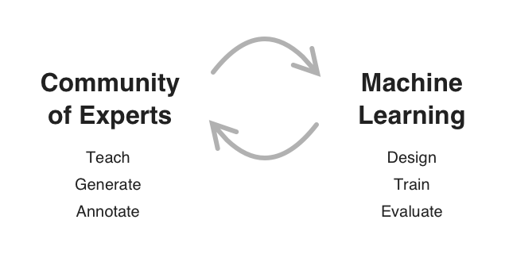

# Visipedia

Visipedia is an academic project that investigates new machine learning techniques and systems for empowering communities of experts.  Visipedia uses machine learning to harness crowdsourced expertise, and deploy that expertise in a utilitarian way. Visipedia has demonstrated success working with the naturalist community to automate the classification of species in images in a way that helps grow the size and capacity of the community of experts. The result is a self reinforcing system of knowledge.

Two of our most successful collaborations have been with the eBird and  iNaturalist communities. The eBird community is generating a robust global dataset of bird images that already includes over 95% of species on Earth. Visipedia is using this dataset to automate photo identification, a feature deployed in the Merlin Bird ID application.  As part of the Merlin Bird ID app, this tool is helping expand bird identification expertise around the world.

With iNaturalist, Visipedia is expanding beyond birds to all life on earth.  The iNaturalist dataset is a global dataset covering all taxonomic groups, but is continuously adding data and species.  Visipedia is constantly retraining with this data and deploying back to the community through the iNaturalist and Seek apps.  In this way, Visipedia is using the iNaturalist dataset to help power the iNaturalist communities capacity as they expand geographic and taxonomic coverage. You can demo the computer vision system here. 

If you wish to learn more about Visipedia, a good place to start is [here](http://www.vision.caltech.edu/publications/perona-ProcIEEE-final.pdf).

Visipedia is also affiliated with the Workshop on Fine-Grained Visual Categorization. The latest incarnation is [FGVC8](https://sites.google.com/view/fgvc8).  

Visipedia is a joint project between Pietro Perona's [Vision Group at Caltech](http://www.vision.caltech.edu/index.html) and Serge Belongie's [Vision Group at Cornell Tech](https://vision.cornell.edu/se3/).  

Sections: [Home](/index.md), [Publications](/publications.md), [Datasets](/datasets.md), [People](/people.md), [Apps](/apps.md)

